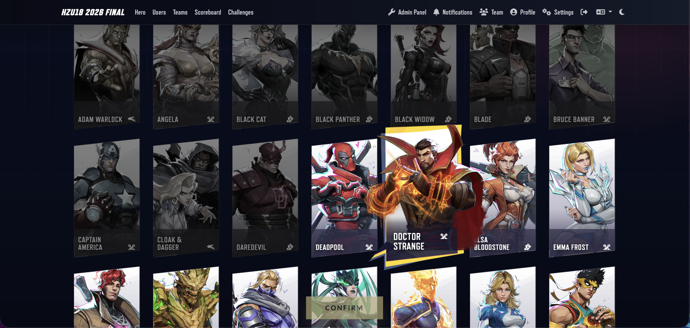
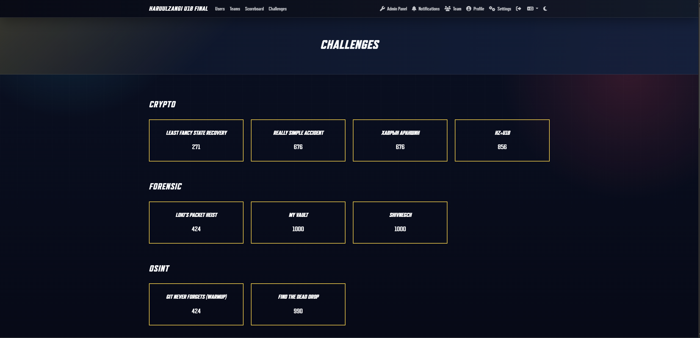
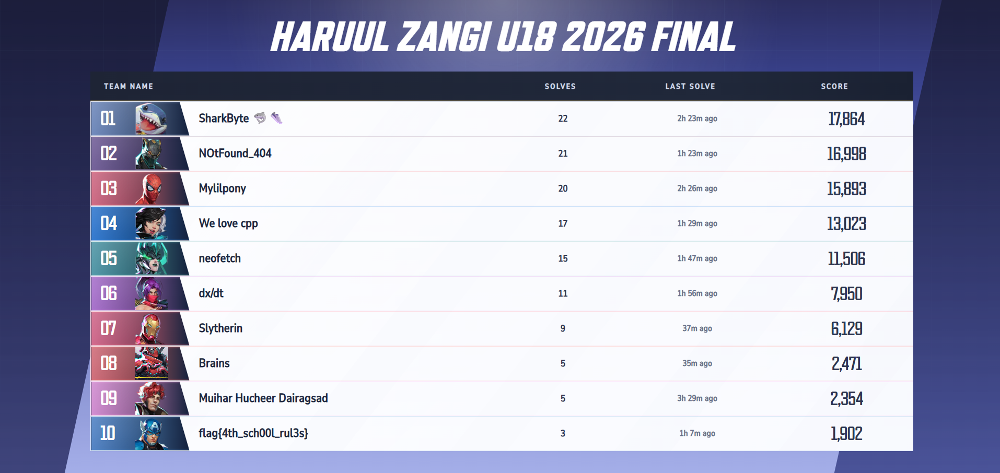

# Haruul Zangi U18 - 2026

> Special thanks to @n0wsh for creating the awesome [CTFd Marvel-Rivals theme](https://github.com/n0wsh/CTFd-Marvel-Rivals-Theme).

## About the Event
Haruul Zangi U18 is public CTF competition for Mongolian high school students/pupils. The competition is meant to discover and develop information security talent at a young age while creating a culture of information security among the younger generation. Participants will tackle challenges across various domains including binary exploitation, cryptography, web exploitation, reverse engineering, forensics, and more.

## Organizers and sponsors
We have organized Haruul Zangi U18 - 2026 with support of following amazing organizations and people who are passionate about cybersecurity not in Mongolia, but also in the world.

### Organizers
- [MNCERT/CC](https://mncert.org)

### Sponsors:
- [Golomt Bank](https://golomtbank.com/)
- [Ssystems](https://ssystems.mn/)
- [Шинэ Монгол 3-р сургууль]

## Contact Information
For inquiries about the competition, please contact:
- Email: hz@haruulzangi.mn
- Social Media: [Facebook Page](https://www.facebook.com/haruulzangiCTF)
